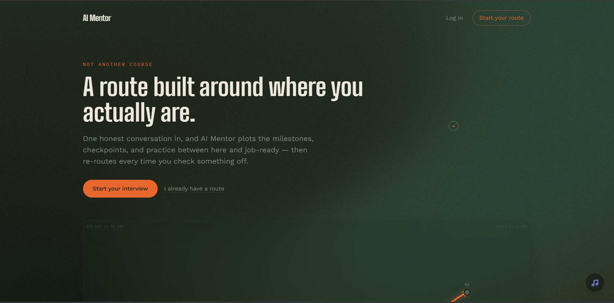
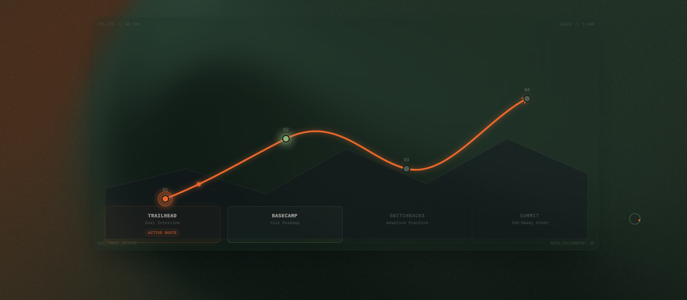
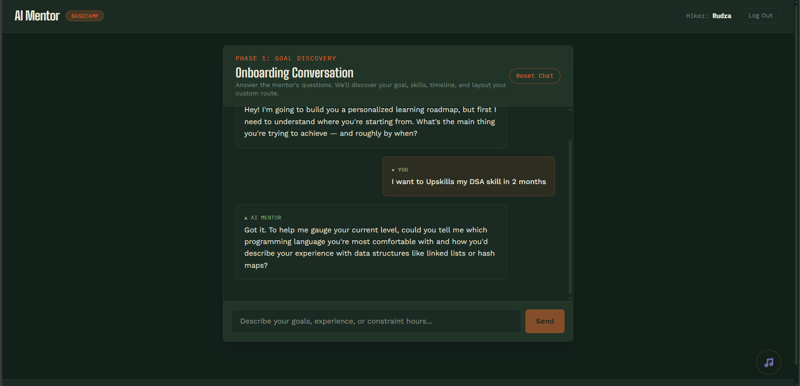
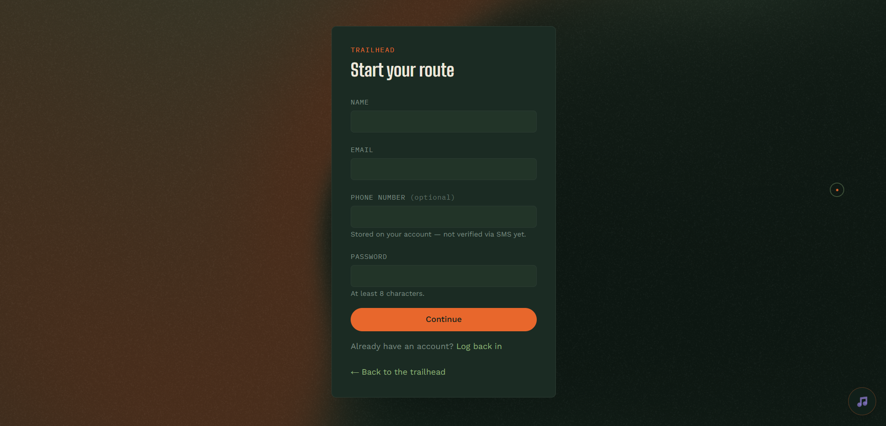
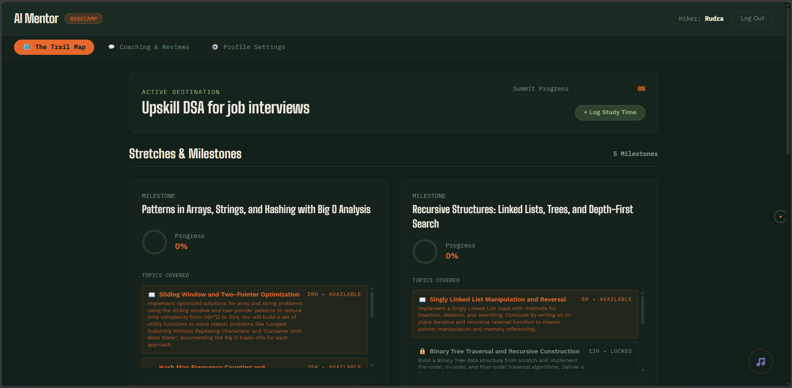
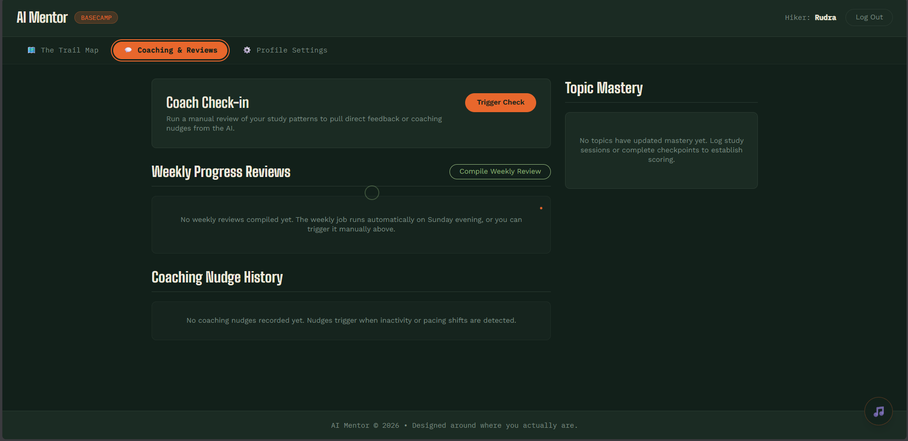

<div align="center">

# 🧭 AI Mentor

### *Not another course. A route built around where you actually are.*

One honest conversation in — and AI Mentor plots the milestones, checkpoints, and practice between here and job-ready. Then it re-routes every time you check something off.

[](https://nodejs.org)
[](https://www.typescriptlang.org)
[](https://fastapi.tiangolo.com)
[](https://react.dev)
[](https://www.postgresql.org)
[](https://ai.google.dev)

</div>

---

## 🏕️ What this actually is

AI Mentor interviews you like a real mentor would — your goal, your hours, what you already know, how you like to learn — then builds a **personalized learning roadmap** from scratch. No template course outline. Every milestone, every topic, every checkpoint quiz is generated for *you*, and the route bends every time you clear a checkpoint or struggle on one.

```
Trailhead              Basecamp              Switchbacks             Summit
(the interview)   →   (your roadmap)   →   (adaptive practice)   →   (job-ready)
```

## ✨ Features

| | |
|---|---|
| 🎙️ **Conversational interview** | A real back-and-forth, not a dropdown form — understands goal, timeline, current level, and learning style |
| 🗺️ **Generated roadmap** | Milestones → topics → prerequisites, built as a real dependency graph, not a flat list |
| 📖 **Real lesson content** | Domain-aware — a presentation-design topic *reads* like a presentation-design lesson. Code examples only show up when code genuinely belongs |
| 📝 **Adaptive checkpoint quizzes** | Topic-specific questions generated per milestone. Score low, and the AI rewrites your route to reinforce the gap |
| 🔐 **Email OTP verification** | Real signup flow — hashed, rate-limited, expiring codes, not a fake gate |
| 🔔 **Nudges & weekly reviews** | Keeps momentum without nagging |
| 🎨 **A theme, not a template** | Night-hike trail-map design system — deep forest palette, trail-blaze accents, a WebGL shader backdrop, and a custom cursor |

## 🏗️ Architecture

```
┌──────────────┐      ┌──────────────────┐      ┌───────────────────────┐
│   Frontend   │ ───▶ │  Node / Express   │ ───▶ │  mentor_ai_engine     │
│  React+Vite  │      │     Backend       │      │      (FastAPI)        │
└──────────────┘      └────────┬──────────┘      └───────────┬───────────┘
                                │                              │
                        ┌───────▼────────┐             ┌───────▼───────┐
                        │   PostgreSQL    │             │  Gemini API   │
                        │    (Prisma)     │             │  (LLM calls)  │
                        └─────────────────┘             └───────────────┘
```

- **`frontend/`** — React + Vite + Tailwind v4. Trail-map design system, real-time interview chat, roadmap visualization, checkpoint quizzes.
- **`backend/`** — Node/Express/TypeScript gateway. Auth (JWT + email OTP), Postgres persistence via Prisma, scheduling, and the single source of truth for the API contract.
- **`mentor_ai_engine/`** — FastAPI service doing all the actual AI work: interview state machine, roadmap generation, lesson content, quiz generation, adaptive rewrites — all via Gemini, all with mock-mode fallbacks for offline dev.

## 🚀 Getting started

```bash
cd backend
cp .env.example .env          # add your Postgres URL, JWT secret, SMTP creds
cp ../mentor_ai_engine/.env.example ../mentor_ai_engine/.env
# add a Gemini API key — https://aistudio.google.com/

docker compose up -d --build
npx prisma migrate dev

cd ../frontend
npm install
npm run dev
```

Frontend → `http://localhost:5173` · Backend → `http://localhost:4000` · AI Engine → `http://localhost:8000`

Set `MOCK_LLM=true` in `mentor_ai_engine/.env` to run the whole flow with zero API calls and zero cost — every phase has a realistic mock fallback.

## 📸 Screenshots

<div align="center">

**Landing**
 

**The Interview**


**Sign In**


**Dashboard & Roadmap**
 

</div>

## 🛠️ Tech stack

**Frontend** — React · TypeScript · Vite · Tailwind CSS v4 · React Router · `@paper-design/shaders-react`
**Backend** — Node.js · Express · TypeScript · Prisma · PostgreSQL · Zod · JWT
**AI Engine** — Python · FastAPI · Gemini (OpenAI-compatible) · Pydantic

---

<div align="center">

*Built one honest conversation at a time.*

</div>
